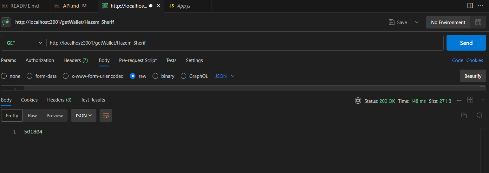
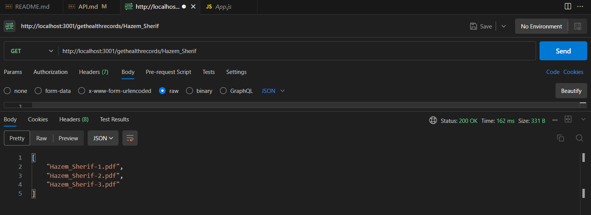

# El7a2ni Clinic Edgerunners

El7a2ni Clinic is a virtual clinic where both doctors and patients benefit from it where:

- Patients can search for available doctors based on various criteria.
- Doctor profiles with qualifications, specialties, and availability.
- Patients can schedule appointments with selected doctors.
- On-premise and online meeting options available.
- Patients can schedule for their family members.
- Both doctor and patient can have a video call for consultation.
- Doctors can prescribe medications electronically and can modify it later if needed.
- Patients can view their prescriptions at any time.
- Doctors have access to medical history of the patient.

## Motivation

our team took up the challenge to reimagine healthcare solutions, bridging the gap between patients and doctors. The motivation behind El7a2ny was to create a virtual clinic ecosystem that not only simplifies medical processes but also enriches the overall patient experience.

## Goal

Our goal is straightforward: to break down the complexities of traditional healthcare systems and offer a solution that anyone can use effortlessly. We believe in making a positive impact on the lives of individuals by providing a streamlined and intuitive healthcare experience.

## Build Status


## Code Style

- **Indentation:** We use Prettier formatter for indentation and maintain a set spaces per level.
- **Naming Conventions:** Variables and functions follow PascalCase naming convention.
- **Braces:** K&R style is used for brace placement.
- **Comments:** Use meaningful comments sparingly to explain complex logic or important details.

## installion

- clone:

```bash
  git clone https://github.com/advanced-computer-lab-2023/Edgerunners-Clinic.git
```

To setup everything

- backend:

```bash
  cd backend
  npm install
```

- frontend:

```bash
  cd frontend
  npm install
```

## Screenshots of website


## Tech/Framework Used

This project is developed using the MERN stack, a popular technology stack for building full-stack web applications. The MERN stack includes:

- **MongoDB:** NoSQL database for storing and retrieving data.
- **Express.js:** A web application framework for building our API and handling HTTP requests.
- **React:** A JavaScript library for building UI.
- **Node.js:** A runtime environment for executing JavaScript code on the server.

### Additional Tools and Libraries

- **Prettier:** The codebase is formatted using Prettier, an opinionated code formatter that enforces a consistent code style.

- **Vite:** Vite is used as the build tool for this project. It provides fast and efficient development server and builds, making the development experience smooth and performance-optimized.

## Features

### Patient-Friendly Appointments

- **Reschedule and Cancel:** Patients have the flexibility to reschedule or cancel appointments at any time before the scheduled appointment. In case of cancellation, the money is automatically returned to the patient's wallet.

- **Family Appointments:** Patients can schedule appointments not only for themselves but also for their family members, all through a single account. This streamlines the process for managing healthcare for the entire family.

### Secure Payment Options

- **Credit Card Payments:** Seamless and secure credit card payments for appointment sessions are supported, ensuring a hassle-free transaction experience for patients.

- **Wallet Integration:** Patients have the option to pay for sessions using their wallet balance, providing a convenient and quick payment method.

### Video Consultations

- **Virtual Consultations:** Connect with healthcare professionals through video chat for remote consultations. This feature enables patients to have virtual face-to-face meetings with doctors for medical advice and guidance.

## How to use

- backend:

```bash
  cd backend/src
  node app
```

- frontend:

```bash
  cd frontend
  npm run dev
```

## Code Examples

**the following shows how based on what type user is entering what routes is open for them**

```jsx
if (
  (sessionStorage.getItem("Username") == null &&
    sessionStorage.getItem("token") == null &&
    sessionStorage.getItem("type") == null) ||
  sessionStorage.getItem("Status") == "Waiting"
) {
  // user hasn't logged in yet so won't acces anything except login page and reset password page only and also register page
  console.log("signin");
  root.render(
    <React.StrictMode>
      <BrowserRouter>
        <Routes>
          <Route path="/" element={<LoginPage />} />
          <Route path="/ResetPass" element={<ResetPass />} />
        </Routes>
      </BrowserRouter>
    </React.StrictMode>
  );
} else if (sessionStorage.getItem("type") == "Patient") {
  // if he is a patient a set of routes is only available for him meaning he can't access doctor's routes even if he know the url
  console.log("patient");
  root.render(
    <React.StrictMode>
      <BrowserRouter>
        <Routes>............</Routes>
      </BrowserRouter>
    </React.StrictMode>
  );
} else if (
  sessionStorage.getItem("type") == "Doctor" &&
  sessionStorage.getItem("Status") == "Accepted"
) {
  // here if the user is a doctor and he/she accepted the terms and conditions and uploaded signed contract and admin accepted then they can access the routes
  console.log("doctor");
  root.render(
    <React.StrictMode>
      <BrowserRouter>
        <Routes>....</Routes>
      </BrowserRouter>
    </React.StrictMode>
  );
} else {
  console.log("admin");
  // we also check here if an admin has logged in
  root.render(
    <React.StrictMode>
      <BrowserRouter>
        <Routes>........</Routes>
      </BrowserRouter>
    </React.StrictMode>
  );
}
```

**the following code shows how we check which user is logging in**

```jsx
const signin = async (req, res) => {
  const username = req.body.Username;
  const password = req.body.Password;
  // at first we check if the user is a patient as they are the ones who will login the most
  let user = await Patient.findOne({ Username: username });
  let isValid;
  if (user) {
    //we check for pasword here and compare it to encrypted database
    isValid = await comparePassword(password, user.Password);
    if (isValid) {
      res.status(200).send({
        token: createJWTP(username),
        type: "Patient",
        Username: username,
        wallet: user.Wallet,
      });
    } else {
      res.status(401).send("invalid password");
    }
  } else {
    // if the user isn't a patient we check if they are a doctor
    user = await Doctor.findOne({ Username: username });
    if (user) {
      isValid = await comparePassword(password, user.Password);
      if (isValid) {
        if (user.Status !== "Pending") {
          res.status(200).send({
            token: createJWTD(username),
            type: "Doctor",
            Username: username,
            Status: user.Status,
            wallet: user.Wallet,
          });
        } else {
          res.status(401).send("Doctor not accepted yet");
        }
      } else {
        res.status(401).send("invalid password");
      }
    } else {
      // lastly we check if he is an admin
      user = await Admin.findOne({ Username: username });
      if (user) {
        isValid = await comparePassword(password, user.Password);
        if (isValid) {
          res.status(200).send({
            token: createJWTA(username),
            type: "Admin",
            Username: username,
          });
        } else {
          res.status(401).send("invalid password");
        }
      } else {
        // if non them match out database he/she entered invalid credentials
        res.status(401).send("user not found");
      }
    }
  }
};
```

## API References

[API-References](API.md)

## Tests using postman





## Contribution

if you would like to contribute there are alot of things to optmize in both backend and frontend.

**backend:**

- optimizing code's efficiency & performance.
- adding more validations for the data that comes from the client side.
- adding more middleware to increase the security of the api server.

**frontend:**

- create better looking UI in Pages.
- add animations to make it look more interactive.
- make website compatible with other devices with different screen sizes.

## Credits

- [how to create api backend nodejs with scott moss](https://frontendmasters.com/courses/api-design-nodejs-v4/)
- [Intro to react with Brian Holt](https://frontendmasters.com/courses/complete-react-v8/)
- [Carousel](https://getbootstrap.com/docs/4.0/components/carousel/)

## License

[MIT license](LICENSE)
